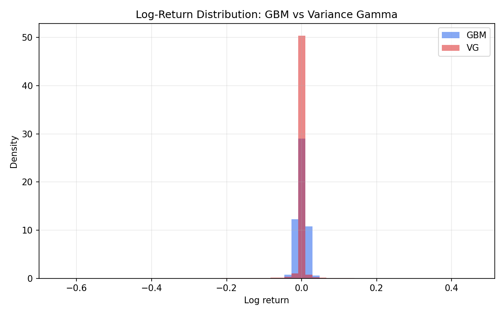
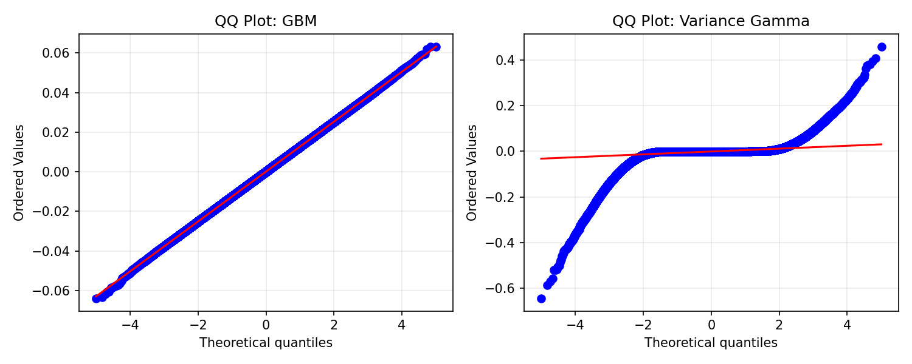
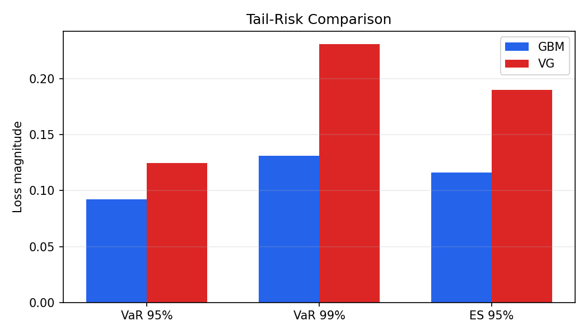
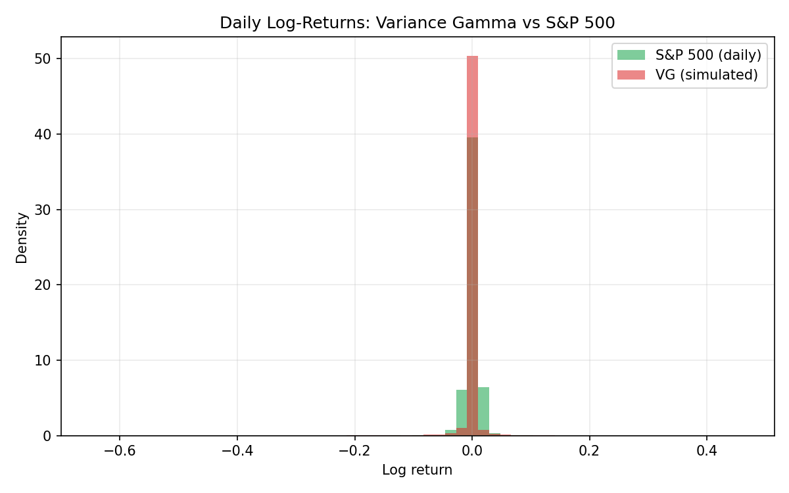
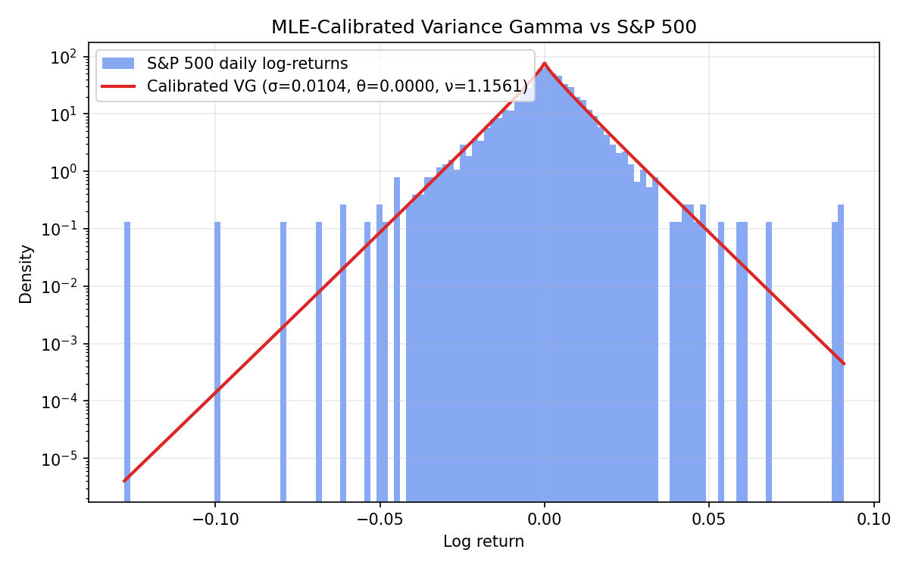

# Heavy-Tailed Financial Market Simulator

A Python framework comparing **Geometric Brownian Motion (GBM)** and the **Variance Gamma (VG)** Lévy process for synthetic asset-price simulation.

> I am actively preparing for this topic by developing a Python framework comparing Geometric Brownian Motion and Variance Gamma market simulations, with the goal of extending it into a reinforcement-learning trading environment under heavy-tailed return distributions.

## Motivation

Standard RL environments for financial markets (e.g. FinRL-Meta) often assume **Gaussian return dynamics**. That assumption breaks down during crashes, jumps, and regime shifts — exactly when risk-aware decision-making matters most.

This project implements a lightweight CPU-only simulator to compare Gaussian and heavy-tailed models using:

- return distributions (histograms, QQ plots)
- VG vs **S&P 500** daily log-returns (yfinance)
- skewness and excess kurtosis
- tail-risk metrics (VaR, expected shortfall)

## Project structure

```
levy-finance-simulator/
├── src/
│   ├── gbm.py          # Geometric Brownian Motion
│   ├── vg.py           # Variance Gamma process
│   ├── metrics.py      # summary statistics and VaR
│   ├── market_data.py  # S&P 500 log-returns via yfinance
│   ├── calibration.py  # VG parameter calibration via MLE
│   └── plots.py        # figure generation
├── notebooks/demo.ipynb
├── figures/
├── report.pdf
└── requirements.txt
```

## Quick start

```bash
python3 -m venv .venv
source .venv/bin/activate
pip install -r requirements.txt
jupyter notebook notebooks/demo.ipynb
```

Or run the core pipeline from the project root:

```bash
source .venv/bin/activate
python - <<'PY'
from src.gbm import simulate_gbm
from src.vg import simulate_vg
from src.metrics import compare_models
from src.plots import generate_all_figures

gbm = simulate_gbm(n_paths=10_000, seed=42)
vg = simulate_vg(theta=-0.14, nu=0.2, n_paths=10_000, seed=42)
print(compare_models([("GBM", gbm.log_returns), ("VG", vg.log_returns)]))
generate_all_figures(gbm.paths, gbm.log_returns, vg.paths, vg.log_returns, gbm.times)
PY
```

## Results preview

Tail-risk metrics below use **21-day aggregated log-returns** (more informative than single-day quantiles under jump dynamics).

| Model | Skewness | Excess kurtosis | VaR 95% | VaR 99% | ES 95% |
|-------|----------|-----------------|---------|---------|--------|
| GBM   | -0.003   | -0.010          | 0.092   | 0.131   | 0.116  |
| VG    | -1.299   | 7.560           | 0.125   | 0.231   | 0.190  |

VG captures stronger negative skewness and heavier tails, leading to materially higher crash-risk estimates.









The VG histogram (illustrative parameters) is overlaid on **S&P 500 daily log-returns** since 2010 (`^GSPC` via yfinance). VG captures heavier tails and negative skew relative to GBM; the market overlay shows the model is in the right ballpark for tail shape, with full calibration left as future work.

## Calibrated Parameters (MLE fit to S&P 500 2010–2026)

| Parameter | Value  | Interpretation |
|-----------|--------|----------------|
| σ (sigma) | 0.0104 | Base volatility |
| θ (theta) | 0.0000 | Skew (negative = crash-prone) |
| ν (nu)    | 1.1561 | Clock variance (fat tails) |

Fitted via Maximum Likelihood Estimation on S&P 500 daily
log-returns (`^GSPC`, 2010–present); 4158 observations,
log-likelihood 13474.82.

```bash
python -m src.calibration
```



> **Note on θ.** In this three-parameter density the location is fixed at zero,
> so θ is simultaneously the skew parameter *and* the mean of the distribution.
> Because the S&P 500 has positive drift, the constraint θ ≤ 0 binds and the
> optimizer pins θ to the boundary. Relaxing the bound gives θ = +0.00045 — the
> sample mean — rather than a crash-skew estimate. Recovering genuine negative
> skew requires either de-meaning the returns before the fit or adding a fourth
> location parameter; that is left as immediate future work.

## Methods (brief)

**GBM**

\[
S_{t+\Delta t} = S_t \exp\left((\mu - \tfrac{1}{2}\sigma^2)\Delta t + \sigma\sqrt{\Delta t}\,Z\right), \quad Z \sim \mathcal{N}(0,1)
\]

**Variance Gamma (VG)**

The VG process is simulated via gamma subordination:

\[
X_t = \theta G_t + \sigma W(G_t), \qquad G_t \sim \text{Gamma subordinator}
\]

with exponential martingale correction for price dynamics.

## Future work

1. Calibrate VG / CGMY / Meixner parameters to institutional market data
2. Wrap the simulator in a **Gymnasium** trading environment
3. Train RL agents under heavy-tailed dynamics
4. Add **explainability** methods (e.g. SHAP on state features, action attribution) to interpret buy/sell decisions under jump risk

See [report.pdf](report.pdf) for a short project note.

## Author

Anupam Varshney — Master's student, Universität des Saarlandes

🏆 Best Group Project Award — Data Science course,
Universität des Saarlandes (Prof. Maaß, June 2026)
